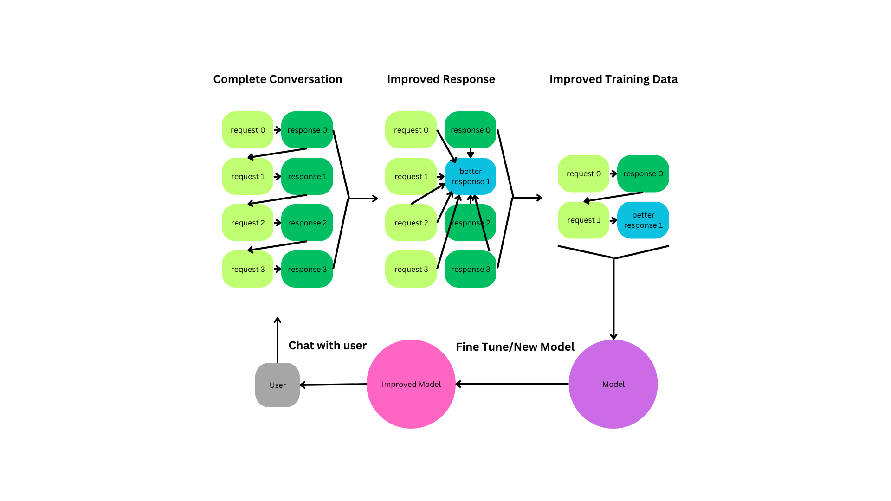

# Generating High Quality Training Data from Multi-Round Chat for Self-Improving Large Language Models


## Introduction

Large language models, like GPT, have transformed natural language processing by achieving unparalleled results in a variety of NLP tasks. However, they still need an extensive amount of high-quality training data for optimal performance. In this project, we propose an innovative method for generating meaningful training data from chat interactions, enabling large language models to become self-evolving.

### core advantage
1. With this approach, we can generate a dataset of high quality conversation/response not just better than native GPT-4, but also better than human level in many cases (because the model already know what is going to happen in the future when making response - we give it to the model).


2. The methodology proposed in this essay for generating training data from chat interactions and enabling self-evolution of large language models has the potential to push these models even further. It is worth noting that OpenAI does not store conversation history data on their end. As a result, it is reasonable to assume that they did not use a method similar to the one proposed here in their model training. This suggests that our approach could indeed offer a novel and promising direction for enhancing the capabilities of large language models.


3. It can be used for improve the data quality for all kinds of data, including human-human/human-AI/AI-human/AI-AI conversations.
## Methodology

Our approach harnesses the power of interactive chat to create high-quality training data. By enabling users to converse with a language model, we can gather a substantial amount of diverse, context-rich data that can be employed for fine-tuning the model.

However, using chat data without further modification is not an ideal approach. To address this, we have designed a method that allows the model to produce improved responses from subsequent conversations. Then, we can use the enhanced response along with the previous conversation as training data, enabling the model to respond more effectively. Ideally, this method should help the model comprehend implicit meanings in a conversation.

This approach not only generates training data, but it also allows the model to continuously evolve and improve through interactions with more users.


## Results

Our method has demonstrated promising results in producing high-quality response/training data. Obviously with the high quality training date generated with the method, we can enhance the performance of large language models. 

Moreover, our self-evolving approach allows the model to continuously improve as it interacts with more users and generates additional training data. This has the potential to result in significant advancements in the overall performance of large language models.

## Conclusion

In summary, our method introduces a new and innovative approach for generating meaningful training data for large language models and making them self-evolving. By capitalizing on the power of interactive chat, we can generate high-quality training data and consistently improve the performance of these models. This has the potential to significantly advance the field of NLP and bring us closer to achieving human-like language understanding in AI.


## Example
### ChatGPT Webchat Input
<details>
  <summary>Click to expand</summary>
  
you can directly copy the text and paste it into GPT-4 webchat

input:
```text
K:Flip a 3-sided coin
L:I'm sorry, I am not able to physically flip a coin. However, I can simulate the outcome of a 3-sided coin flip for you. The possible outcomes are heads, tails and side.
Q:flip it for me
A:The outcome of the 3-sided coin flip is:
heads
Q:again
A:The outcome of the 3-sided coin flip is:
tails
Q:again
A:The outcome of the 3-sided coin flip is:
side
Q:How can a 3 sided coin exist
A:A three-sided coin can exist physically, but it would not function like a traditional coin with two sides. It would be a triangular prism with three flat faces. Each face would have a different design or inscription, and when the coin is flipped, one of the three faces would land facing up.
It's a hypothetical object, not a real coin and it's not used for any practical purposes.
Q:so how did you flip one
A:As a language model, I don't have the ability to physically flip a coin. I used a random number generator and a pre-defined set of outcomes to simulate a 3-sided coin flip, and returned one of the predefined outcomes as the result of the flip.
It is important to note that this is not a real coin flip, it's just a way of simulate one.

You should only respond in JSON format as described below 
Response Format: 
{
    "Criticism": "Criticism on L according to consequent chats",
    "K": "K, unchanged",
    "L": "The new answer to K regarding the criticism"
} 
Ensure the response can beparsed by Python json.loads
```
Response:
```text
{
"Criticism": "The user initially seemed to accept the hypothetical nature of the 3-sided coin but later questioned its existence, which may indicate some confusion.",
"K": "Flip a 3-sided coin",
"L": "I apologize for any confusion. As a language model, I can't physically flip a coin. The 3-sided coin is a hypothetical concept, and I simulated the flip using a random number generator to provide an outcome. If you have any other questions or need clarification, please feel free to ask."
}
```
</details>

### OpenAI Api Request
<details>
  <summary>Click to expand</summary>

[You can find the dataset here](https://huggingface.co/datasets/philschmid/sharegpt-raw/blob/main/sharegpt_20230401_clean_lang_split.json)

  code: (In demo.py)

```python
pass
```
Response:
```text
Conversation:
K:
[[[
Flip a 3-sided coin
]]]
L:
[[[
I'm sorry, I am not able to physically flip a coin. However, I can simulate the outcome of a 3-sided coin flip for you. The possible outcomes are heads, tails and side.
]]]
Q:
[[[
flip it for me
]]]
A:
[[[
The outcome of the 3-sided coin flip is:
heads
]]]
Q:
[[[
again
]]]
A:
[[[
The outcome of the 3-sided coin flip is:
tails
]]]
Q:
[[[
again
]]]
A:
[[[
The outcome of the 3-sided coin flip is:
side
]]]
Q:
[[[
How can a 3 sided coin exist
]]]
A:
[[[
A three-sided coin can exist physically, but it would not function like a traditional coin with two sides. It would be a triangular prism with three flat faces. Each face would have a different design or inscription, and when the coin is flipped, one of the three faces would land facing up.
It's a hypothetical object, not a real coin and it's not used for any practical purposes.
]]]
Q:
[[[
so how did you flip one
]]]
A:
[[[
As a language model, I don't have the ability to physically flip a coin. I used a random number generator and a pre-defined set of outcomes to simulate a 3-sided coin flip, and returned one of the predefined outcomes as the result of the flip.
It is important to note that this is not a real coin flip, it's just a way of simulate one.
]]]

You should leave K unchanged and implement C and L.
Pretend you are having a new chat and answering K.
You should only respond in JSON format as described below 
Response Format: 
{
    "K": "'Flip a 3-sided coin'",
    "C": "Criticism on L according to consequent chats",
    "L": "A response str answers K."
} 
Ensure the response can beparsed by Python json.loads
{
    "K": "Flip a 3-sided coin",
    "C": "The initial response, L, refers to a hypothetical 3-sided coin flip as a physical action while providing outcomes as heads, tails, and side. However, later it becomes clear that a 3-sided coin is an unrealistic concept and the action being performed is actually a simulation.",
    "L": "I'm sorry, I am not able to physically flip a coin. However, I can simulate the outcome of a hypothetical 3-sided coin flip for you. The possible outcomes are 1, 2, and 3."
}
```
</details>


### Training Data
<details>
  <summary>Click to expand</summary>
This is just a simple example, you can modify it as you want

example:

  ```text
Q: Flip a 3-sided coin
A: I'm sorry, I am not able to physically flip a coin. However, I can simulate the outcome of a hypothetical 3-sided coin flip for you. The possible outcomes are 1, 2, and 3.
```
</details>

## Response Examples
<details>
  <summary>Click to expand</summary>

```text
Q:Flip a 3-sided coin
OLD:I'm sorry, I am not able to physically flip a coin. However, I can simulate the outcome of a 3-sided coin flip for you. The possible outcomes are heads, tails and side.
NEW:I'm sorry, a 3-sided coin doesn't exist in the real world, so I cannot simulate a flip for you. However, I can still help with any other questions or requests you might have.

Q:the current color hexes contrast fine for dark background. I need alternative hexes of the same colors for white background.
OLD:Sure, here are alternative hex codes for the same colors that have a high enough contrast for use on a white background:

* Primary Color: #2F6D92 (blue)
* Secondary Color: #6FAC7E (green)
* Accent Color: #FF9AA2 (pink)

These hex codes have been adjusted to provide a higher contrast ratio when used on a white background, while still retaining the same general hue and saturation as the original colors. Please note that the exact contrast ratio may vary depending on the specific design and context in which the colors are used.
NEW:Here are alternative hex codes for the same colors with higher contrast ratios against a white background while maintaining the original hues: Primary Color: #2F6D92 (blue); Secondary Color: #3A793A (green); Accent Color: #CC415A (pink). These colors now have better contrast ratios and should be more suitable for use on a white background.

```
</details>

## WIPs
1. Generate a dataset
2. Validate the quality of response in statistical data (even though it's obviously better)
3. Using data generated with this method on fine-tuning an open-source LLM
4. Publish the LLM for public access, and use the public chat data for further model updates (this is why it is called self evolve)